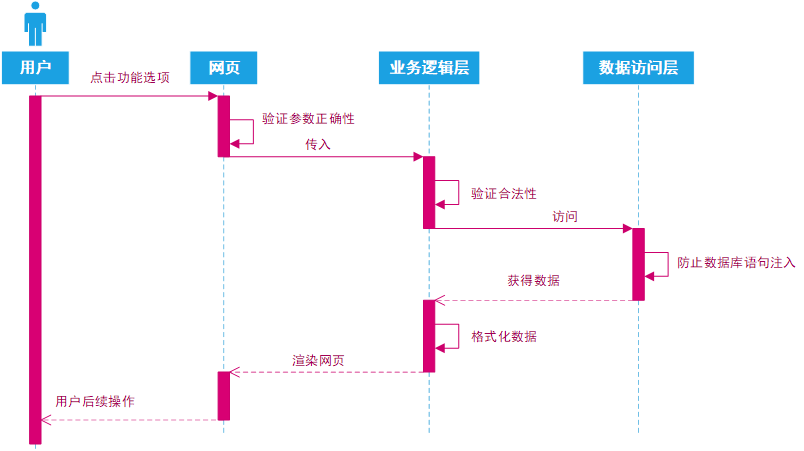

## 项目名称:社团选课管理系统
## 系统功能分析  
系统角色分为三种，分别为学生、老师以及管理员。  
（1）	学生模块功能  
1. 根据所在社团显示对应课程；
2. 选择社团的课程；
3. 查看课程选课详情；
4. 变更社团；
5. 修改个人信息；
6. 查看自己的社团；

（2）	老师模块功能  
1. 显示自己开设的课程；
2. 添加新课程；
3. 删除课程；
4. 修改课程；
5. 查看选课详情；
6. 选课管理；
7. 查看社团信息；
8. 修改个人信息；

（3）	管理员模块功能  
1. 课程管理；
2. 修改个人信息；
3. 查看所有社团；
4. 删除社团；
5. 修改社团；
6. 添加社团；
7. 学生账号管理；
8. 老师账号管理；
9. 重置密码；
10. 删除账号；

## 流程分析
### 系统架构图
  
### 用户登录顺序图
  
### 系统交互图
   
### 层次关系图
  
### 数据库关系图  
   

## 数据库设计  
### 社团信息表（t_assn_info）  
社团信息表主要有社团编号、社团名字、社团创始人、现任社长、社团成立时间、社团内容、社团简介、社团地址这8个字段:  
| 字段名称         | 数据类型    | 长度  | 是否允许空 | 是否为主键 | 字段描述   |
|--------------|---------|-----|-------|-------|--------|
| aid          | int     | 11  | 否     | 是     | 社团编号   |
| assn_name    | varchar | 255 | 否     | 否     | 社团名称   |
| assn_founder | varchar | 255 | 否     | 否     | 社团创始人  |
| assn_leader  | varchar | 255 | 否     | 否     | 现任社长   |
| assn_time    | varchar | 255 | 否     | 否     | 社团成立时间 |
| assn_content | varchar | 255 | 否     | 否     | 社团内容   |
| assn_brief   | varchar | 255 | 否     | 否     | 社团简介   |
| assn_address | varchar | 255 | 否     | 否     | 社团地址   |

### 课程信息表（t_course_info）  
课程信息表主要有课程编号、社团编号（外键）、教师编号（外键）、课程名称、开课学期、学分、授课地点、已选人数、课程总人数这9个字段
| 字段名称       | 数据类型    | 长度 | 是否允许空 | 是否为主键 | 字段描述    |
|------------|---------|----|-------|-------|---------|
| cid        | int     | 20 | 否     | 是     | 课程编号    |
| aid        | int     | 10 | 否     | 否     | 外键，社团编号 |
| tid        | int     | 10 | 否     | 否     | 外键，教师编号 |
| c_name     | varchar | 20 | 否     | 否     | 课程名称    |
| c_time     | varchar | 20 | 否     | 否     | 开课学期    |
| c_credit   | float   |    | 否     | 否     | 学分      |
| c_place    | varchar | 20 | 否     | 否     | 授课地点    |
| c_selected | int     | 11 | 否     | 否     | 已选人数    |
| c_amount   | int     | 11 | 否     | 否     | 课程总人数   |

### 学生信息表（t_student_info）  
学生信息表主要有学生编号、社团编号（外键）、学生账号、学生密码、学生姓名、学生性别、学生年龄、所属院系, 电话号码这9个字段  
| 字段名称     | 数据类型    | 长度 | 是否允许空 | 是否为主键 | 字段描述    |
|----------|---------|----|-------|-------|---------|
| sid      | int     | 10 | 否     | 是     | 学生编号    |
| aid      | int     | 10 | 否     | 否     | 外键，社团编号 |
| username | varchar | 20 | 否     | 否     | 学生账号    |
| password | varchar | 20 | 否     | 否     | 学生密码    |
| realname | varchar | 20 | 否     | 否     | 学生姓名    |
| sex      | varchar | 2  | 否     | 否     | 学生性别    |
| year     | varchar | 4  | 否     | 否     | 学生年龄    |
| faculty  | varchar | 20 | 否     | 否     | 所属院系    |
| phone    | varchar | 20 | 否     | 否     | 电话号码    |

### 教师信息表（t_teacher_info）  
教师信息表主要有教师编号、教师账号、教师密码、教师姓名、教师性别、教师年龄、电话号码这7个字段  
| 字段名称       | 数据类型    | 长度 | 是否允许空 | 是否为主键 | 字段描述 |
|------------|---------|----|-------|-------|------|
| tid        | int     | 10 | 否     | 是     | 教师编号 |
| t_username | varchar | 20 | 否     | 否     | 教师账号 |
| t_password | varchar | 20 | 否     | 否     | 教师密码 |
| t_realname | varchar | 10 | 否     | 否     | 教师姓名 |
| t_sex      | varchar | 2  | 否     | 否     | 教师性别 |
| t_age      | varchar | 4  | 否     | 否     | 教师年龄 |
| t_phone    | varchar | 20 | 否     | 否     | 电话号码 |

### 选课信息表（t_elective_info）  
选课信息表主要有课程编号、学生编号（外键）、课程编号（外键）、社团编号（外键）、课程id（外键）这4个字段
| 字段名称 | 数据类型    | 长度 | 是否允许空 | 是否为主键 | 字段描述    |
|------|---------|----|-------|-------|---------|
| eid  | int     | 10 | 否     | 是     | 选课编号    |
| sid  | int     | 10 | 否     | 否     | 外键，学生编号 |
| cid  | varchar | 10 | 否     | 否     | 外键，课程编号 |
| aid  | int     | 10 | 否     | 否     | 外键，社团编号 |

## 效果图  
### 登录:  
点击登录后前台会校验格式，正确后转入后台。 
首先验证验证码，当验证码错误时提示：“登录失败，验证码错误”，通过验证后检查用户名和密码，都通过后进入主页，如果错误提示“登录失败”。所有用户都通过此页面登录系统。  
  

### 学生注册:
登录页面点击注册即可转入注册页面。在注册前前台会进行格式检查，当检查通过后会转入后台处理，若用户名重复则提示，反之则注册。  
  

### 学生选课:
学生登录后主页右侧默认为学生选课，也可以通过点击侧边栏的子系统下的课程管理到达学生选课页面。在此界面下学生能查看当前所属社团下的课程信息，并通过操作列分别进行选课、退课和查看选课的情况。当点击选课时，系统会先判断用户的操作是否是点击网页上显示的链接，若不是将提示“非法访问”，若是则判断是否已经选课，若已选课则提示“你已选了本课程”，若不是将检测人数满员，若满员则提示“人数已满”，若不满则执行添加选课记录。当点击退课时，系统一样会进行链接合法校验，选课校验，通过后执行退课。  

### 学生查看所有社团:
当学生点击侧边栏的子系统下的查看所有社团时，页面将转到所有社团信息页面。该页面能够更换学生所在社团，以及查看社团详细内容。当学生点击更改社团时，前台会检测是否有选课信息，若有则提示“你在当前的社团有选课，无法更换社团”，若没有则转入后台校验是否为学生，不是则提示“没有学生数据!”，是则判断选课情况是否为零，若为零则改变学生所在社团，并注销登录。

### 老师修改课程:  
通过点击课程管理下的某一课程后的修改进入修改课程页面，授课老师为登录老师本人，无法更改。当已有学生选择当前课程时，课程将无法更改所属社团，已选人数为系统自动生成无法修改。当对信息更改完毕后点击修改按钮后前台将进行数据校验，数据校验通过后将转入后台，后台将对用户权限进行检查，通过后检查课程总人数是否大于等于已选人数，若未通过检查则提示“选课总人数不能小于已选人数”，若通过检查则判断是否有学生选课，若有学生选课并且所属社团修改了则提示“当前课程已有学生选课，无法更改所属社团”，若不满足检查条件则执行修改操作。  

### 管理员查看所有课程信息:  
管理员主页右侧默认为课程管理，也可以通过点击侧边栏的子系统下的课程管理到达课程管理页面。在此界面下能显示全部课程，并能通过操作列分别对课程进行查看、修改、删除。管理员包含老师的所有权限，所以在修改课程信息时可以修改课程的授课老师。并在课程管理多出一个筛选功能，能够按照社团分别筛选课程信息。  

### 管理员查看所有社团信息:  
当管理员点击侧边栏的子系统下的社团管理时，页面将转到所有社团信息页面。该页面列出了社团，并显示了相关可以操作。  

### 管理员管理学生账号:  
当管理员点击侧边栏的子系统下的学生账号管理时，页面将转到该页面。该页面将显示所有学生信息，学生密码默认是隐藏状态，当鼠标移动到学生密码上时才会显示学生密码。可以进行删除和重置密码。在进入该功能前，系统会验证用户权限，若没有通过则提示“你不是管理员”。当管理员点击学生信息后面的删除时前端会弹出提示确认，若点击确认将转入系统。系统会再次验证用户权限，并判断是否由当前网页链接访问，当都没有问题后会查询选课情况，若该学生还有选课则提示“当前学生账号已选课，无法删除!”，若没有选课则执行删除学生账号操作。当点击重置时系统依然要验证权限，与网页链接访问，当验证均通过后将对学生密码进行重置，重置后的密码为学生账号，会在前台提示“已重置密码为账号名”。  

### 管理员管理教师账号:  
当管理员点击侧边栏的子系统下的老师账号管理时，页面将转到老师账号显示页面。老师的信息会显示在页面上，教师密码默认是隐藏状态，当鼠标移动到教师密码上时才会显示教师密码。可以进行删除、重置密码和添加。进入前将验证权限，通过后方可进入。当管理员点击老师信息后面的删除时前端会弹出提示确认，若点击确认将转入系统。系统会再次验证用户权限，并判断是否由当前网页链接访问，当都没有问题后会查询该老师的开课情况，若该老师还有课程则提示“当前教师账号下有课程，无法删除!”，若没有课程则执行删除老师账号操作。当点击重置时系统依然要验证权限，与网页链接访问，当验证均通过后将对教师密码进行重置，重置后的密码为教师账号，会在前台提示“已重置密码为账号名”。  

## 工具类
### MySql.java  
使用数据库语句的封装,用以更新或者查询数据库内容,频繁使用
将返回的结果通过list,LinkedHashMap封装后返回,以及分页功能的实现.
### Tools.java  
工具类:用以辅助
删除数组中的元素并重构数组
### Translate.java
翻译类:翻译数据库字段显示在前端的文字
### LoginFilter.java
全局拦截:未登陆账号则进入login,并且兼任全局修改编码类型为utf-8.
### Captcha.java
使用Graphics2D动态绘制验证码,验证码图片大小可动态调整.

## 使用技术:
网页使用的技术：JavaScript、Bootstrap、JQuery、JSP、JSTL、阿里图标库；  
后台使用的技术：SSM框架集  
数据库使用： MySQL  
IDE使用：IntelliJ IDEA  
Web服务器：apache-tomcat  

## 项目依赖  
aspectjweaver-1.8.13.jar  
mybatis-3.5.4.jar  
log4j-core-2.13.0.jar  
spring-web-5.0.2.RELEASE.jar  
spring-core-5.0.2.RELEASE.jar  
spring-context-5.0.2.RELEASE.jar  
spring-webmvc-5.0.2.RELEASE.jar  
javassist-3.26.0-GA.jar  
mysql-connector-java-5.1.7-bin.jar  
spring-beans-5.0.2.RELEASE.jar  
log4j-1.2.17.jar  
spring-jdbc-5.0.2.RELEASE.jar  
spring-aop-5.0.2.RELEASE.jar  
cglib-3.3.0.jar  
log4j-api-2.13.0.jar  
servlet-api.jar  
commons-dbcp2-2.7.0-tests.jar  
spring-expression-5.0.2.RELEASE.jar  
ognl-3.2.12.jar  
spring-tx-5.0.2.RELEASE.jar  
javax.el-3.0.1-b08.jar  
commons-io-2.6.jar  
commons-pool2-2.8.0-tests.jar  
commons-dbcp2-2.7.0.jar  
taglibs-standard-impl-1.2.5.jar  
spring-orm-5.0.2.RELEASE.jar  
javax.persistence.jar  
commons-pool2-2.8.0.jar  
asm-7.1.jar  
commons-fileupload-1.4.jar  
mybatis-spring-2.0.4.jar  
jboss-logging-3.3.0.Final.jar  
classmate-1.3.1.jar  
validation-api-1.1.0.Final.jar  
jsp-api.jar  
commons-logging-1.2.jar  
javax.ejb.jar  
javax.resource.jar  
slf4j-api-1.7.30.jar  
spring-aspects-5.0.2.RELEASE.jar  
taglibs-standard-spec-1.2.5.jar  
javax.servlet.jsp.jstl.jar  
javax.jms.jar  
slf4j-log4j12-1.7.30.jar  
javax.transaction.jar  
javax.annotation.jar  
aopalliance-1.0.jar  

## 数据库文件  
[数据库文件](演示/community_management2.sql)